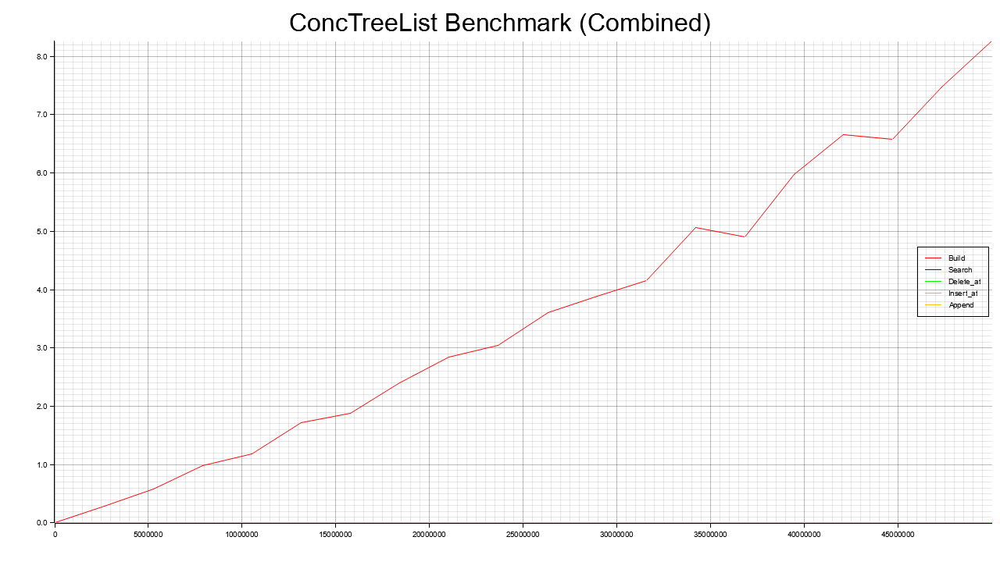
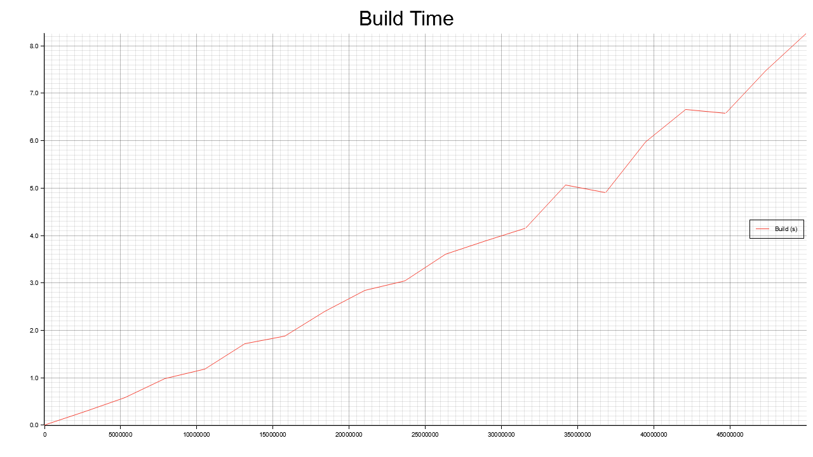
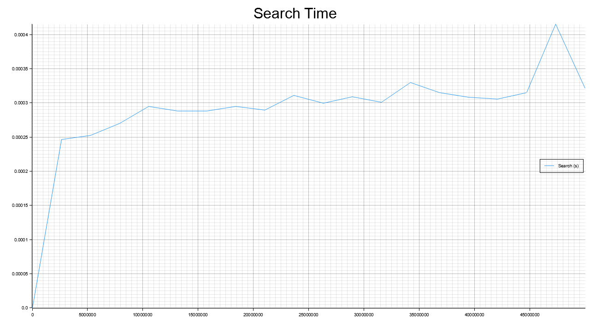
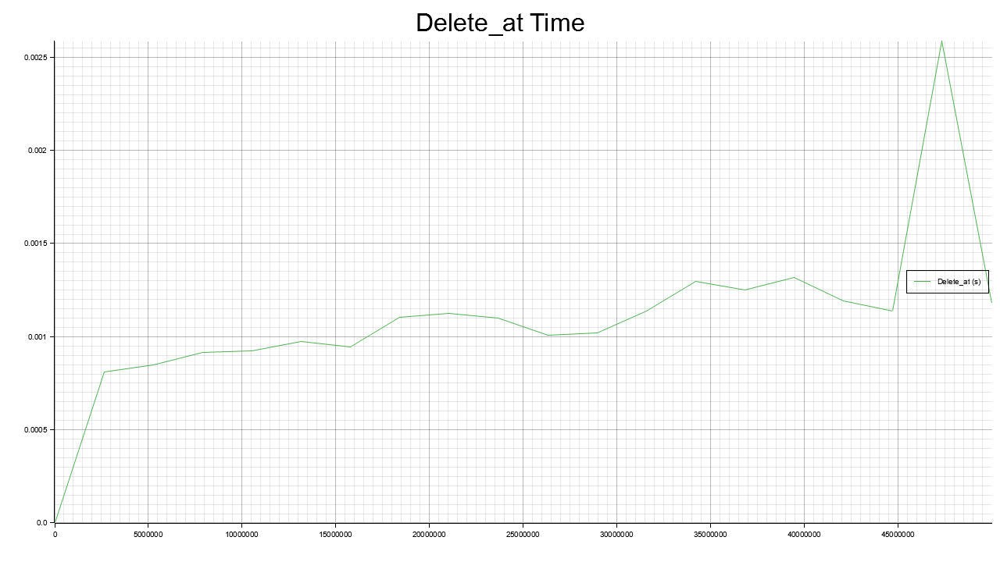
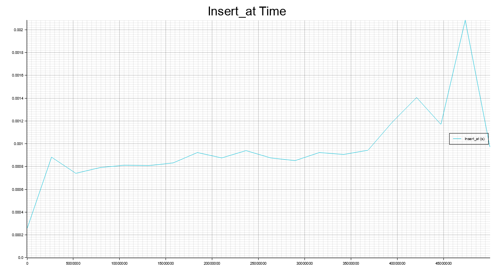
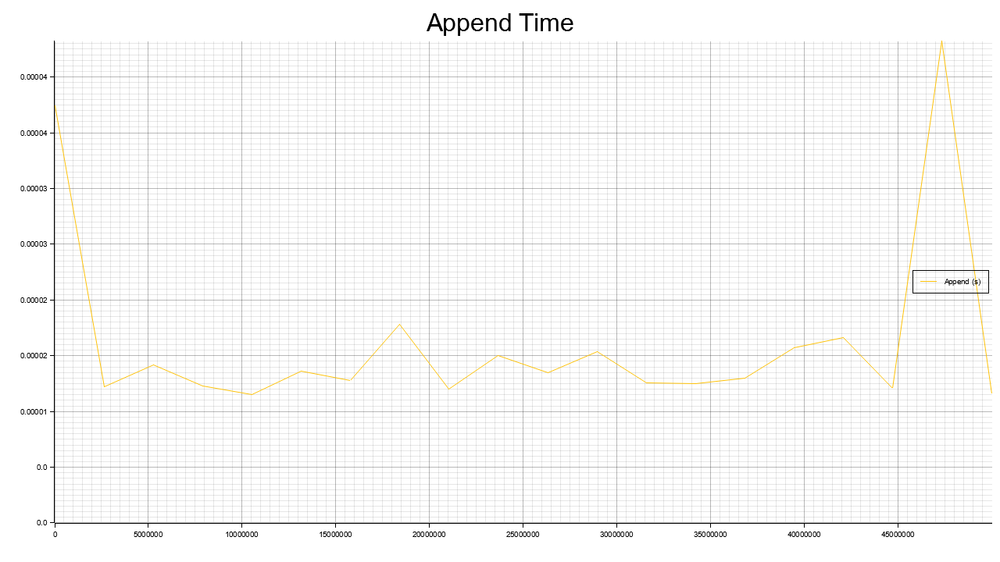

# ConcTreeList

ConcTreeList is an immutable, persistent tree-based list data structure designed for functional programming and concurrent environments. It combines the benefits of trees (efficient, logarithmic access and updates) with the simplicity of lists. Modifications return a new version of the tree without altering the original, making it ideal for functional and concurrent applications.

## Concept

A **ConcTreeList** is structured as a balanced binary tree composed of three kinds of nodes:

- **Empty:** Represents an empty list.
- **Single:** Contains a single element.
- **Append:** Combines two subtrees and stores the total size of the subtree. This allows for efficient indexing and concatenation.

This design provides the following performance characteristics (assuming the tree remains balanced):

- **Access (`get`):** O(log n)
- **Insertion / Deletion (using `insert_at` / `delete_at`):** O(log n) because only the nodes along the path from the root to the target are rebuilt.
- **Concatenation (`concat`):** O(1) in theory, though rebalancing might be required for optimal performance.
- **Build Operation:** Constructing a balanced tree from a vector has O(n) time complexity.

Below are sample images (produced by the benchmark tool) that illustrate the performance of various operations:

- 
- 
- 
- 
- 
- 

## Library Overview (`lib.rs`)

The library implements the ConcTreeList data structure. The code is split into two main sections:

### Basic Operations (do not require `T: Clone`)
- **`new`**: Creates an empty ConcTreeList.
- **`single`**: Creates a tree containing a single element.
- **`concat`**: Concatenates two ConcTreeLists.
- **`get`**: Retrieves an element by its index.
- **`iter`**: Provides an iterator for in-order traversal of the tree.

### Advanced Operations (require `T: Clone`)
- **`from_vec` / `from_slice`**: Build a balanced ConcTreeList from a vector or slice.
- **`rebalance`**: Rebuilds the tree to ensure it remains balanced.
- **`delete_at`**: Removes an element at a specific index and returns a new tree.
- **`insert_at`**: Inserts a new element at a given index and returns a new tree.

These advanced operations ensure that modifications affect only the path from the root to the target, achieving O(log n) time complexity in a balanced tree.

## Benchmark CLI Overview (`main.rs`)

The CLI application is designed to benchmark various operations on the ConcTreeList:
- **Build:** Constructs the tree from a vector using `from_vec`.
- **Search:** Performs multiple `get` operations.
- **Delete_at:** Deletes elements at random positions using the `delete_at` function.
- **Insert_at:** Inserts new elements at random positions using the `insert_at` function.
- **Append:** Appends new elements using the `concat` function.

The application measures the execution time for each operation and generates graphs:
- A **combined graph** (`benchmark_combined.png`) shows all operations.
- **Individual graphs** for each operation (e.g., `benchmark_build.png`, `benchmark_search.png`, etc.) are also generated.

The code runs each benchmark step **sequentially** (each input size is processed one after the other).

## Using the CLI

### Building the Project

Ensure that you have Rust installed. Then compile the project in release mode:

```bash
cargo build --release
```

### Running the Benchmark

You can run the benchmark using the following command:

```bash
cargo run --release -- 5000 --end 50000 --steps 10 --table --plot
```

### Command-Line Options

--start: Starting number of elements (e.g., 5000).
--end: Ending number of elements (e.g., 50000). If omitted, only one benchmark is run.
--steps: Number of intermediate sizes between start and end (default is 10).
--table: If provided, the benchmark results are printed as a table in the console.
--plot: If provided, the benchmark graphs are generated and saved as PNG images.